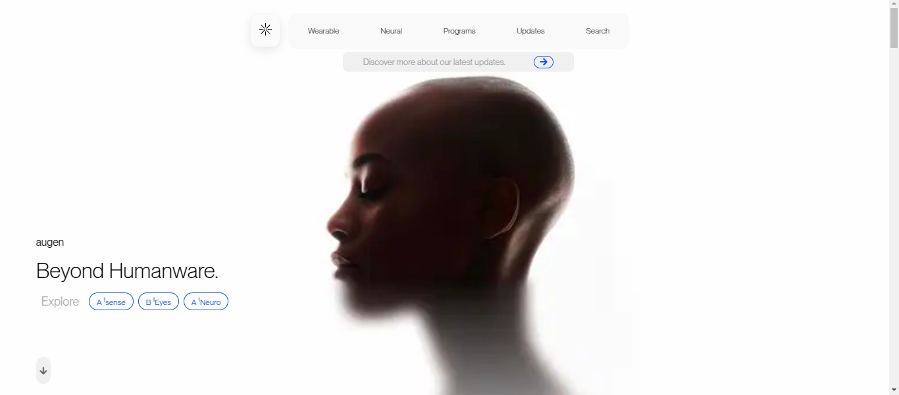
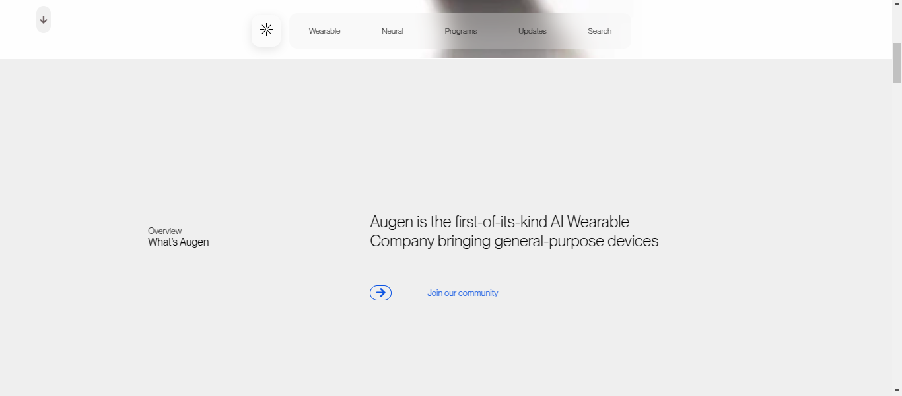
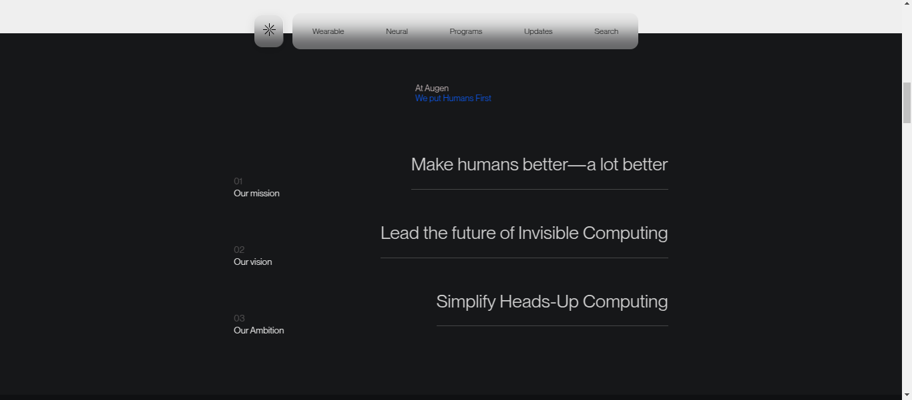
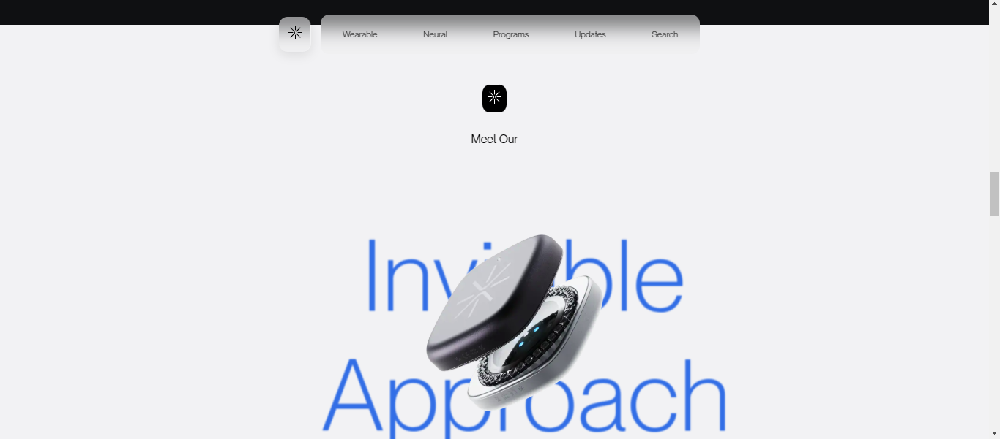
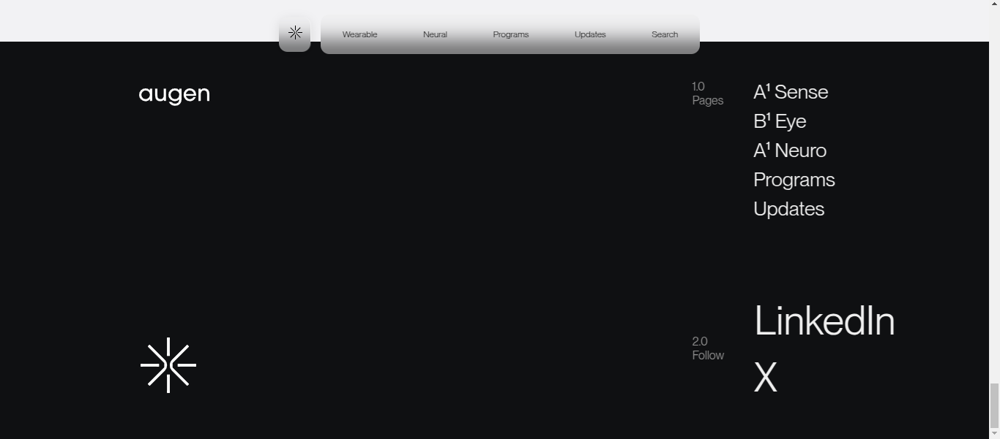

# Augen-Pro

This is the Augen-Pro project, showcasing various sections with clean and smooth scrolling.

## Sections

### Section 1: Introduction
A brief introduction to the site. This section includes a stylish and minimal design.

  <!-- Replace with actual image path -->

### Section 2: Features
This section highlights the core features and functionalities of the website.

  <!-- Replace with actual image path -->

### Section 3: About
This section describes more about the project and the inspiration behind it.

  <!-- Replace with actual image path -->

### Section 4: Contact
A contact form for users to get in touch.

  <!-- Replace with actual image path -->

### Section 5: Footer
The footer section with additional links and copyright information.

  <!-- Replace with actual image path -->

## Installation

Follow these steps to install and run the project locally:

1. Clone the repository:
   ```bash
   git clone https://github.com/attharvsabale/augen-pro.git

